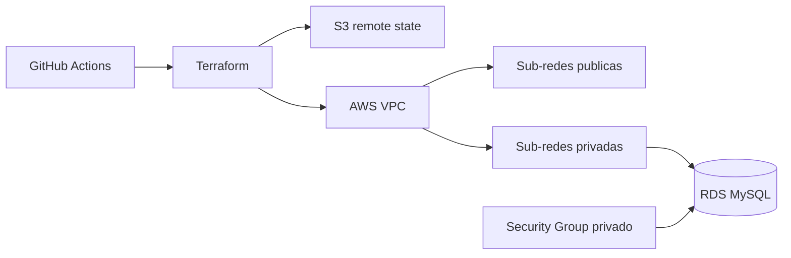

# Infraestrutura do banco da Oficina Mecanica

Este repositorio provisiona a base da infraestrutura AWS da Oficina Mecanica:

- bucket S3 compartilhado para os states do Terraform;
- VPC e Internet Gateway;
- sub-redes publicas para o EKS e privadas para o banco;
- Security Group do MySQL;
- instancia gerenciada Amazon RDS MySQL.

O RDS nao e publico. O acesso na porta 3306 e liberado posteriormente pelos
repositorios do Kubernetes e da Lambda, sempre por referencia a Security Groups.

## Tecnologias

- Terraform
- Amazon VPC
- Amazon RDS for MySQL
- Amazon S3
- GitHub Actions

Nao existe Dockerfile neste repositorio porque ele contem apenas infraestrutura
como codigo; Terraform e AWS CLI sao executados diretamente pelo GitHub Actions.

## Arquitetura deste repositorio



## CI/CD

`Integracao continua - Banco` valida formatacao e sintaxe do Terraform em todo
Pull Request e push na `main`.

`Entrega continua AWS - Banco` e manual para proteger os creditos do AWS
Academy. Ela deve ser a primeira entrega executada quando o ambiente for criado.

Secrets necessarios no GitHub:

- `AWS_ACCESS_KEY_ID`
- `AWS_SECRET_ACCESS_KEY`
- `AWS_SESSION_TOKEN`

## Validar localmente sem criar recursos

Na raiz do repositorio, execute:

```bash
terraform fmt -check -recursive infra
terraform -chdir=infra init -backend=false
terraform -chdir=infra validate
```

O parametro `-backend=false` impede o acesso ao state S3. Esses comandos baixam
providers e validam os arquivos, mas nao criam VPC, RDS ou qualquer outro
recurso na AWS.

## Implantar em producao

1. Inicie o AWS Academy Learner Lab.
2. Atualize os tres repository secrets com as credenciais de `AWS Details`.
3. Confirme que as alteracoes foram aprovadas e integradas na branch `main`.
4. Abra `Actions -> Entrega continua AWS - Banco`.
5. Clique em `Run workflow`, selecione `main` e confirme.
6. Aguarde o Summary exibir o endpoint privado do RDS e o nome do banco.

A pipeline prepara o bucket de state, executa `terraform plan`, aplica o plano e
publica apenas outputs nao sensiveis no Summary. Nenhum comando local e
necessario durante o deploy.

## Ordem de deploy

1. Banco
2. Kubernetes
3. Aplicacao
4. Lambda

A destruicao ocorre na ordem inversa. Este repositorio deve ser destruido por
ultimo, pois tambem remove o bucket com os states compartilhados.

Para remover, abra `Actions -> Destruir infraestrutura AWS - Banco`, execute na
`main` e informe `DESTRUIR`. A pipeline recusa a operacao se os states de
Kubernetes, aplicacao ou Lambda ainda contiverem recursos.

## Swagger

Este repositorio nao expoe APIs. O Swagger pertence a
[aplicacao principal](https://github.com/kaziwon/techchallengerm372882) e sua URL
publica e apresentada no resumo da pipeline de entrega da aplicacao.

Diagramas completos, RFCs, ADRs e a justificativa do banco estao no
[`docs/README.md` da aplicacao principal](https://github.com/kaziwon/techchallengerm372882/blob/main/docs/README.md).
