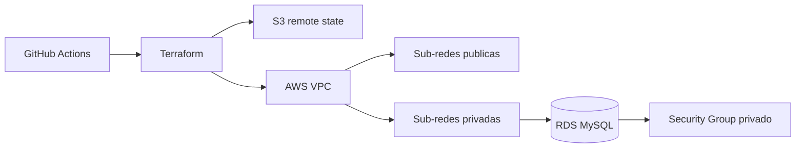

# Infraestrutura do banco da Oficina Mecanica

Este repositorio provisiona a base da infraestrutura AWS da Oficina Mecanica:

- bucket S3 compartilhado para os states do Terraform;
- VPC e Internet Gateway;
- sub-redes publicas para o EKS e privadas para o banco;
- Security Group do MySQL;
- instancia gerenciada Amazon RDS MySQL.

O RDS nao e publico. O acesso na porta 3306 e liberado posteriormente pelos
repositorios do Kubernetes e da Lambda, sempre por referencia a Security Groups.

## Tecnologias

- Terraform
- Amazon VPC
- Amazon RDS for MySQL
- Amazon S3
- GitHub Actions

## Arquitetura deste repositorio

## CI/CD

`Integracao continua - Banco` valida formatacao e sintaxe do Terraform em todo
Pull Request e push na `main`.

`Entrega continua AWS - Banco` e manual para proteger os creditos do AWS
Academy. Ela deve ser a primeira entrega executada quando o ambiente for criado.

Secrets necessarios no GitHub:

- `AWS_ACCESS_KEY_ID`
- `AWS_SECRET_ACCESS_KEY`
- `AWS_SESSION_TOKEN`

## Ordem de deploy

1. Banco
2. Kubernetes
3. Aplicacao
4. Lambda

A destruicao ocorre na ordem inversa. Este repositorio deve ser destruido por
ultimo, pois tambem remove o bucket com os states compartilhados.

## Swagger

Este repositorio nao expoe APIs. O Swagger pertence a
[aplicacao principal](https://github.com/kaziwon/techchallengerm372882) e sua URL
publica e apresentada no resumo da pipeline de entrega da aplicacao.
